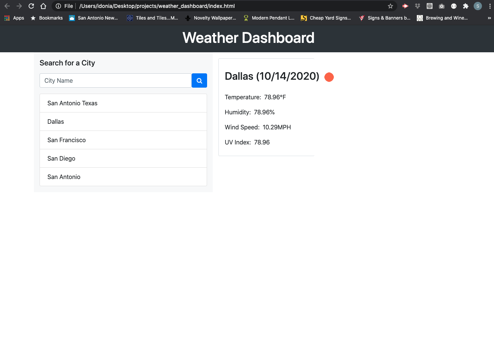

# Weather Dashboard

## Description
An application that allows the user to enter a location to find the current weather forecast. The site also provides the user with the UV rating for the area and a 5-Day Forecast. 

## Table of Contents

* [`Technologies`](#technologies)
* [`Screenshots`](#screenshots)
* [`Deployment`](#deployment)
* [`Questions`](#questions)

## Technologies
* HTML
* CSS
* Bootstrap
* JQuery
* Open Weather API

## GitHub Repository

[GitHub](https://github.com/sidoniag/weather_dashboard)

## Deployment

[Deployed Application](https://sidoniag.github.io/weather_dashboard/)

## Page Preview

## Questions
Visit my [github](https://github.com/sidoniag)

Or [email](seekersig@gmail.com) me directly